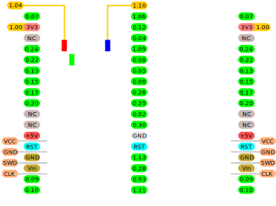

## Processor and Module

The BlueMacro840 uses the nRF52840 from Nordic Semiconductors. For an overview of the features of this SoC, refer to Nordic's [Product Page](https://www.nordicsemi.com/Products/Low-power-short-range-wireless/nRF52840).  The most important features are as follows:

* 64 MHz Cortex-M4 with FPU
* 1 MB Flash, 256 KB RAM
* 2.4 GHz Transceiver
* -20 to +8 dbm programmable TX Power
* 48 configurable GPIOs

For a detailed description of the nRF52840, you can download the [datasheet](https://infocenter.nordicsemi.com/pdf/nRF52840_PS_v1.1.pdf) (619 pages).

The BlueMacro840 uses the [Ebyte E73-2G4M08S1C module](https://s.click.aliexpress.com/e/_dWxR3nN). This module is FCC and CE certified.  
The module uses a ceramic antenna and makes 32 GPIOs available externally, 2 of which are reserved for the low frequency crystal oscilator and 1 is reserved for the reset button.
For a detailed description of the module, refer to the [manual](http://www.ebyte.com/en/downpdf.aspx?id=445).

## Bootloader

Although the BlueMacro840 can be programmed using the Nordic Software Development Kit and other commercial tools, we recommend using the open source [Adafruit nRF52 Bootloader](https://github.com/adafruit/Adafruit_nRF52_Bootloader) as the bootloader for bootloader the BlueMicro840.  Two versions of the bootloader are compatible with the BlueMacro840:

* [Nordic nRF52840-DK](https://www.nordicsemi.com/Software-and-Tools/Development-Kits/nRF52840-DK) - also named PCA10056
* [BlueMicro840](http://nrf52.jpconstantineau.com/docs/bluemicro840_v1).

You can obtain the above bootloaders from the following locations:

* release artifacts of the [Adafruit Repo](https://github.com/adafruit/Adafruit_nRF52_Bootloader/releases)
* release artifacts of the [Forked Repo](https://github.com/jpconstantineau/Adafruit_nRF52_Bootloader/releases)
* Adafruit nRF52 Arduino Board Support Package
* Community Add-on to Adafruit nRF52 Arduino Board Support Package

## Firmware

## Pinout

## PCB
| Top  | Bottom  |
|---|---|
|    |   |

## Schematic

## Building it yourself?

You need to order the parts included in this [csv BOM](https://raw.githubusercontent.com/jpconstantineau/NRF52-Board/master/BlueMacro840/BlueMacro.csv).  You can it load in Excel.  The LCSC column refers to the part number at [LCSC.com](https://lcsc.com/).

If you are assembling the BlueMicro840 yourself, refer to the [HTML Bom](http://nrf52.jpconstantineau.com/bom/BlueMacro840/ibom.html) to help you as you assemble it.